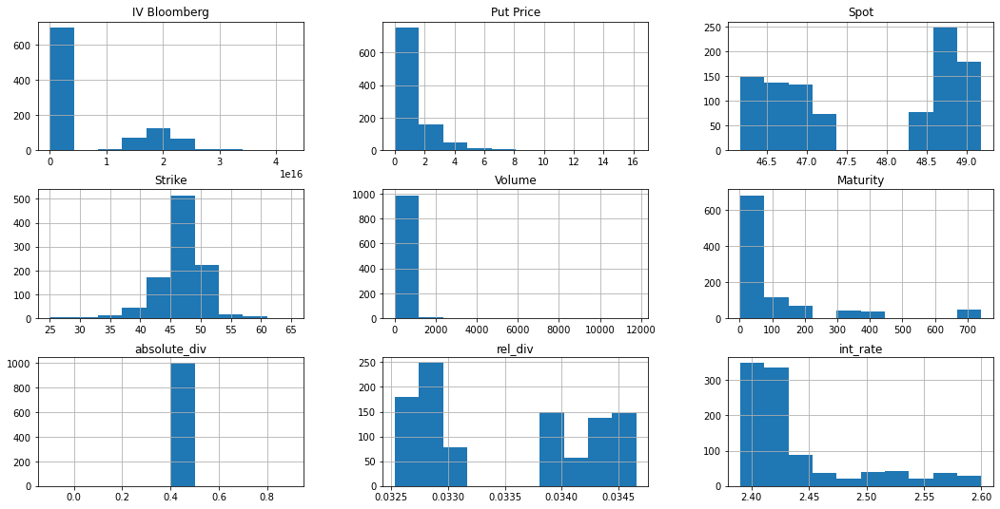
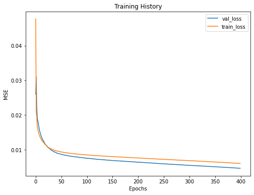
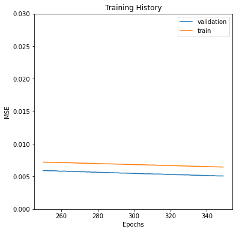

```python
## Here we explore how on can price american options using neural networks. This was first seen in the recent paper titled "Neural Network pricing of American put options" appeared in the MDPI jornal in April 2020. 
## The work presents that without using stochastic calculus and using neural networks one can predict the price of american option.
## In fact the work also presents that this model does better than the Least square Monte carlo method.
## This code is partial of what can be seen in the paper and has been presented with the help of one of the helpful authors Mr. Bernardo Sequeira.
```


```python
import pandas as pd
import numpy as np
import matplotlib.pyplot as plt
from tqdm import tqdm_notebook
from sklearn.model_selection import train_test_split
```


```python
X= pd.read_csv("cleaned_data_subset.csv", sep='\\\t', engine='python')
X=X.rename(columns={'Company"': 'Company', '"IV Bloomberg': 'IV Bloomberg'})
X=X.drop(columns=['today'])
X.head(20)
```


<div>
<style scoped>
    .dataframe tbody tr th:only-of-type {
        vertical-align: middle;
    }

    .dataframe tbody tr th {
        vertical-align: top;
    }

    .dataframe thead th {
        text-align: right;
    }
</style>
<table border="1" class="dataframe">
  <thead>
    <tr style="text-align: right;">
      <th></th>
      <th>IV Bloomberg</th>
      <th>Put Price</th>
      <th>Spot</th>
      <th>Strike</th>
      <th>Volume</th>
      <th>Maturity</th>
      <th>absolute_div</th>
      <th>rel_div</th>
      <th>int_rate</th>
      <th>Company</th>
    </tr>
  </thead>
  <tbody>
    <tr>
      <th>0</th>
      <td>"0.185022449493408</td>
      <td>1.68</td>
      <td>48.2785</td>
      <td>40.0</td>
      <td>35.0</td>
      <td>714.0</td>
      <td>0.4</td>
      <td>0.033141</td>
      <td>2.52</td>
      <td>KO"</td>
    </tr>
    <tr>
      <th>1</th>
      <td>"0.166804180145264</td>
      <td>3.06</td>
      <td>48.2785</td>
      <td>45.0</td>
      <td>18.0</td>
      <td>714.0</td>
      <td>0.4</td>
      <td>0.033141</td>
      <td>2.52</td>
      <td>KO"</td>
    </tr>
    <tr>
      <th>2</th>
      <td>"0.160661716461182</td>
      <td>3.75</td>
      <td>48.2785</td>
      <td>47.0</td>
      <td>7.0</td>
      <td>714.0</td>
      <td>0.4</td>
      <td>0.033141</td>
      <td>2.52</td>
      <td>KO"</td>
    </tr>
    <tr>
      <th>3</th>
      <td>"0.151099138259888</td>
      <td>5.13</td>
      <td>48.2785</td>
      <td>50.0</td>
      <td>35.0</td>
      <td>714.0</td>
      <td>0.4</td>
      <td>0.033141</td>
      <td>2.52</td>
      <td>KO"</td>
    </tr>
    <tr>
      <th>4</th>
      <td>"0.137878675460815</td>
      <td>8.25</td>
      <td>48.2785</td>
      <td>55.0</td>
      <td>1.0</td>
      <td>714.0</td>
      <td>0.4</td>
      <td>0.033141</td>
      <td>2.52</td>
      <td>KO"</td>
    </tr>
    <tr>
      <th>5</th>
      <td>"0.13358140945434602</td>
      <td>10.10</td>
      <td>48.2785</td>
      <td>57.5</td>
      <td>6.0</td>
      <td>714.0</td>
      <td>0.4</td>
      <td>0.033141</td>
      <td>2.52</td>
      <td>KO"</td>
    </tr>
    <tr>
      <th>6</th>
      <td>"0.126878786087036</td>
      <td>12.10</td>
      <td>48.2785</td>
      <td>60.0</td>
      <td>17.0</td>
      <td>714.0</td>
      <td>0.4</td>
      <td>0.033141</td>
      <td>2.52</td>
      <td>KO"</td>
    </tr>
    <tr>
      <th>7</th>
      <td>"0.29667272567749</td>
      <td>0.02</td>
      <td>48.2785</td>
      <td>45.0</td>
      <td>1.0</td>
      <td>7.0</td>
      <td>0.4</td>
      <td>0.033141</td>
      <td>2.41</td>
      <td>KO"</td>
    </tr>
    <tr>
      <th>8</th>
      <td>"0.226072883605957</td>
      <td>0.01</td>
      <td>48.2785</td>
      <td>46.0</td>
      <td>18.0</td>
      <td>7.0</td>
      <td>0.4</td>
      <td>0.033141</td>
      <td>2.41</td>
      <td>KO"</td>
    </tr>
    <tr>
      <th>9</th>
      <td>"0.19854175567627</td>
      <td>0.03</td>
      <td>48.2785</td>
      <td>46.5</td>
      <td>121.0</td>
      <td>7.0</td>
      <td>0.4</td>
      <td>0.033141</td>
      <td>2.41</td>
      <td>KO"</td>
    </tr>
    <tr>
      <th>10</th>
      <td>"0.167277050018311</td>
      <td>0.04</td>
      <td>48.2785</td>
      <td>47.0</td>
      <td>24.0</td>
      <td>7.0</td>
      <td>0.4</td>
      <td>0.033141</td>
      <td>2.41</td>
      <td>KO"</td>
    </tr>
    <tr>
      <th>11</th>
      <td>"0.149363269805908</td>
      <td>0.06</td>
      <td>48.2785</td>
      <td>47.5</td>
      <td>874.0</td>
      <td>7.0</td>
      <td>0.4</td>
      <td>0.033141</td>
      <td>2.41</td>
      <td>KO"</td>
    </tr>
    <tr>
      <th>12</th>
      <td>"0.138306550979614</td>
      <td>0.12</td>
      <td>48.2785</td>
      <td>48.0</td>
      <td>274.0</td>
      <td>7.0</td>
      <td>0.4</td>
      <td>0.033141</td>
      <td>2.41</td>
      <td>KO"</td>
    </tr>
    <tr>
      <th>13</th>
      <td>"0.12322995185852101</td>
      <td>0.26</td>
      <td>48.2785</td>
      <td>48.5</td>
      <td>543.0</td>
      <td>7.0</td>
      <td>0.4</td>
      <td>0.033141</td>
      <td>2.41</td>
      <td>KO"</td>
    </tr>
    <tr>
      <th>14</th>
      <td>"0.115330629348755</td>
      <td>0.48</td>
      <td>48.2785</td>
      <td>49.0</td>
      <td>29.0</td>
      <td>7.0</td>
      <td>0.4</td>
      <td>0.033141</td>
      <td>2.41</td>
      <td>KO"</td>
    </tr>
    <tr>
      <th>15</th>
      <td>"0.10234254837036101</td>
      <td>0.80</td>
      <td>48.2785</td>
      <td>49.5</td>
      <td>1.0</td>
      <td>7.0</td>
      <td>0.4</td>
      <td>0.033141</td>
      <td>2.41</td>
      <td>KO"</td>
    </tr>
    <tr>
      <th>16</th>
      <td>"0.254826831817627</td>
      <td>0.05</td>
      <td>48.2785</td>
      <td>45.0</td>
      <td>16.0</td>
      <td>14.0</td>
      <td>0.4</td>
      <td>0.033141</td>
      <td>2.41</td>
      <td>KO"</td>
    </tr>
    <tr>
      <th>17</th>
      <td>"0.23896640777587902</td>
      <td>0.08</td>
      <td>48.2785</td>
      <td>45.5</td>
      <td>101.0</td>
      <td>14.0</td>
      <td>0.4</td>
      <td>0.033141</td>
      <td>2.41</td>
      <td>KO"</td>
    </tr>
    <tr>
      <th>18</th>
      <td>"0.225940341949463</td>
      <td>0.10</td>
      <td>48.2785</td>
      <td>46.0</td>
      <td>106.0</td>
      <td>14.0</td>
      <td>0.4</td>
      <td>0.033141</td>
      <td>2.41</td>
      <td>KO"</td>
    </tr>
    <tr>
      <th>19</th>
      <td>"0.217727851867676</td>
      <td>0.16</td>
      <td>48.2785</td>
      <td>46.5</td>
      <td>55.0</td>
      <td>14.0</td>
      <td>0.4</td>
      <td>0.033141</td>
      <td>2.41</td>
      <td>KO"</td>
    </tr>
  </tbody>
</table>
</div>


```python
X['IV Bloomberg'] = X['IV Bloomberg'].str.replace(r'\D', '')
X['Company'] = X['Company'].str.replace(r'"', '')
X['IV Bloomberg'] = X['IV Bloomberg'].astype(float)
X.head()
```


<div>
<style scoped>
    .dataframe tbody tr th:only-of-type {
        vertical-align: middle;
    }

    .dataframe tbody tr th {
        vertical-align: top;
    }

    .dataframe thead th {
        text-align: right;
    }
</style>
<table border="1" class="dataframe">
  <thead>
    <tr style="text-align: right;">
      <th></th>
      <th>IV Bloomberg</th>
      <th>Put Price</th>
      <th>Spot</th>
      <th>Strike</th>
      <th>Volume</th>
      <th>Maturity</th>
      <th>absolute_div</th>
      <th>rel_div</th>
      <th>int_rate</th>
      <th>Company</th>
    </tr>
  </thead>
  <tbody>
    <tr>
      <th>0</th>
      <td>1.850224e+14</td>
      <td>1.68</td>
      <td>48.2785</td>
      <td>40.0</td>
      <td>35.0</td>
      <td>714.0</td>
      <td>0.4</td>
      <td>0.033141</td>
      <td>2.52</td>
      <td>KO</td>
    </tr>
    <tr>
      <th>1</th>
      <td>1.668042e+14</td>
      <td>3.06</td>
      <td>48.2785</td>
      <td>45.0</td>
      <td>18.0</td>
      <td>714.0</td>
      <td>0.4</td>
      <td>0.033141</td>
      <td>2.52</td>
      <td>KO</td>
    </tr>
    <tr>
      <th>2</th>
      <td>1.606617e+14</td>
      <td>3.75</td>
      <td>48.2785</td>
      <td>47.0</td>
      <td>7.0</td>
      <td>714.0</td>
      <td>0.4</td>
      <td>0.033141</td>
      <td>2.52</td>
      <td>KO</td>
    </tr>
    <tr>
      <th>3</th>
      <td>1.510991e+14</td>
      <td>5.13</td>
      <td>48.2785</td>
      <td>50.0</td>
      <td>35.0</td>
      <td>714.0</td>
      <td>0.4</td>
      <td>0.033141</td>
      <td>2.52</td>
      <td>KO</td>
    </tr>
    <tr>
      <th>4</th>
      <td>1.378787e+14</td>
      <td>8.25</td>
      <td>48.2785</td>
      <td>55.0</td>
      <td>1.0</td>
      <td>714.0</td>
      <td>0.4</td>
      <td>0.033141</td>
      <td>2.52</td>
      <td>KO</td>
    </tr>
  </tbody>
</table>
</div>


```python
X.hist(figsize=(18,9))
plt.show()
```


    

    


```python
X.isnull().sum()
```


    IV Bloomberg    0
    Put Price       0
    Spot            0
    Strike          0
    Volume          0
    Maturity        0
    absolute_div    0
    rel_div         0
    int_rate        0
    Company         0
    dtype: int64


```python
from sklearn.preprocessing import MinMaxScaler
from sklearn.impute import SimpleImputer
X.columns
imputed_X = X.copy()
```


```python
#mean_imputer = Imputer(strategy='mean', axis=0)
#mean_imputer = mean_imputer.fit(X)
mean_imputer= SimpleImputer(missing_values=np.nan, strategy='mean')
imputed_X = mean_imputer.fit_transform(X.drop(columns=['Company']))
#imputed_X = pd.DataFrame(imputed_X)#, columns = X.columns)
type(imputed_X)
imputed_X.shape
```


    (998, 9)


```python
imputed_X = pd.DataFrame(imputed_X, columns = ['IV Bloomberg', 'Put Price', 'Spot', 'Strike', 'Volume', 'Maturity','absolute_div', 'rel_div', 'int_rate'])
imputed_X.head()
```


<div>
<style scoped>
    .dataframe tbody tr th:only-of-type {
        vertical-align: middle;
    }

    .dataframe tbody tr th {
        vertical-align: top;
    }

    .dataframe thead th {
        text-align: right;
    }
</style>
<table border="1" class="dataframe">
  <thead>
    <tr style="text-align: right;">
      <th></th>
      <th>IV Bloomberg</th>
      <th>Put Price</th>
      <th>Spot</th>
      <th>Strike</th>
      <th>Volume</th>
      <th>Maturity</th>
      <th>absolute_div</th>
      <th>rel_div</th>
      <th>int_rate</th>
    </tr>
  </thead>
  <tbody>
    <tr>
      <th>0</th>
      <td>1.850224e+14</td>
      <td>1.68</td>
      <td>48.2785</td>
      <td>40.0</td>
      <td>35.0</td>
      <td>714.0</td>
      <td>0.4</td>
      <td>0.033141</td>
      <td>2.52</td>
    </tr>
    <tr>
      <th>1</th>
      <td>1.668042e+14</td>
      <td>3.06</td>
      <td>48.2785</td>
      <td>45.0</td>
      <td>18.0</td>
      <td>714.0</td>
      <td>0.4</td>
      <td>0.033141</td>
      <td>2.52</td>
    </tr>
    <tr>
      <th>2</th>
      <td>1.606617e+14</td>
      <td>3.75</td>
      <td>48.2785</td>
      <td>47.0</td>
      <td>7.0</td>
      <td>714.0</td>
      <td>0.4</td>
      <td>0.033141</td>
      <td>2.52</td>
    </tr>
    <tr>
      <th>3</th>
      <td>1.510991e+14</td>
      <td>5.13</td>
      <td>48.2785</td>
      <td>50.0</td>
      <td>35.0</td>
      <td>714.0</td>
      <td>0.4</td>
      <td>0.033141</td>
      <td>2.52</td>
    </tr>
    <tr>
      <th>4</th>
      <td>1.378787e+14</td>
      <td>8.25</td>
      <td>48.2785</td>
      <td>55.0</td>
      <td>1.0</td>
      <td>714.0</td>
      <td>0.4</td>
      <td>0.033141</td>
      <td>2.52</td>
    </tr>
  </tbody>
</table>
</div>


```python
scaler = MinMaxScaler(feature_range=(0, 1))
rescaledX = scaler.fit_transform(imputed_X)#.drop(columns=['Company']))
rescaledX = pd.DataFrame(rescaledX)
rescaledX['Company']=X['Company']
rescaledX.columns = X.columns
```


```python
rescaledX=rescaledX.drop(columns=['Volume','absolute_div', 'rel_div', 'int_rate','Company' ])
rescaledX.head()
```


<div>
<style scoped>
    .dataframe tbody tr th:only-of-type {
        vertical-align: middle;
    }

    .dataframe tbody tr th {
        vertical-align: top;
    }

    .dataframe thead th {
        text-align: right;
    }
</style>
<table border="1" class="dataframe">
  <thead>
    <tr style="text-align: right;">
      <th></th>
      <th>IV Bloomberg</th>
      <th>Put Price</th>
      <th>Spot</th>
      <th>Strike</th>
      <th>Maturity</th>
    </tr>
  </thead>
  <tbody>
    <tr>
      <th>0</th>
      <td>0.004333</td>
      <td>0.103150</td>
      <td>0.700634</td>
      <td>0.375</td>
      <td>0.960916</td>
    </tr>
    <tr>
      <th>1</th>
      <td>0.003907</td>
      <td>0.188388</td>
      <td>0.700634</td>
      <td>0.500</td>
      <td>0.960916</td>
    </tr>
    <tr>
      <th>2</th>
      <td>0.003763</td>
      <td>0.231007</td>
      <td>0.700634</td>
      <td>0.550</td>
      <td>0.960916</td>
    </tr>
    <tr>
      <th>3</th>
      <td>0.003539</td>
      <td>0.316245</td>
      <td>0.700634</td>
      <td>0.625</td>
      <td>0.960916</td>
    </tr>
    <tr>
      <th>4</th>
      <td>0.003229</td>
      <td>0.508956</td>
      <td>0.700634</td>
      <td>0.750</td>
      <td>0.960916</td>
    </tr>
  </tbody>
</table>
</div>


```python
imputed_X=imputed_X.drop(columns=['Volume','absolute_div', 'rel_div', 'int_rate' ])
imputed_X
```


<div>
<style scoped>
    .dataframe tbody tr th:only-of-type {
        vertical-align: middle;
    }

    .dataframe tbody tr th {
        vertical-align: top;
    }

    .dataframe thead th {
        text-align: right;
    }
</style>
<table border="1" class="dataframe">
  <thead>
    <tr style="text-align: right;">
      <th></th>
      <th>IV Bloomberg</th>
      <th>Put Price</th>
      <th>Spot</th>
      <th>Strike</th>
      <th>Maturity</th>
    </tr>
  </thead>
  <tbody>
    <tr>
      <th>0</th>
      <td>1.850224e+14</td>
      <td>1.680000</td>
      <td>48.2785</td>
      <td>40.0</td>
      <td>714.0</td>
    </tr>
    <tr>
      <th>1</th>
      <td>1.668042e+14</td>
      <td>3.060000</td>
      <td>48.2785</td>
      <td>45.0</td>
      <td>714.0</td>
    </tr>
    <tr>
      <th>2</th>
      <td>1.606617e+14</td>
      <td>3.750000</td>
      <td>48.2785</td>
      <td>47.0</td>
      <td>714.0</td>
    </tr>
    <tr>
      <th>3</th>
      <td>1.510991e+14</td>
      <td>5.130000</td>
      <td>48.2785</td>
      <td>50.0</td>
      <td>714.0</td>
    </tr>
    <tr>
      <th>4</th>
      <td>1.378787e+14</td>
      <td>8.250000</td>
      <td>48.2785</td>
      <td>55.0</td>
      <td>714.0</td>
    </tr>
    <tr>
      <th>...</th>
      <td>...</td>
      <td>...</td>
      <td>...</td>
      <td>...</td>
      <td>...</td>
    </tr>
    <tr>
      <th>993</th>
      <td>1.704195e+14</td>
      <td>0.520000</td>
      <td>49.1807</td>
      <td>47.0</td>
      <td>66.0</td>
    </tr>
    <tr>
      <th>994</th>
      <td>1.621152e+13</td>
      <td>0.730000</td>
      <td>49.1807</td>
      <td>48.0</td>
      <td>66.0</td>
    </tr>
    <tr>
      <th>995</th>
      <td>1.535704e+14</td>
      <td>1.130000</td>
      <td>49.1807</td>
      <td>49.0</td>
      <td>66.0</td>
    </tr>
    <tr>
      <th>996</th>
      <td>1.474474e+14</td>
      <td>1.510000</td>
      <td>49.1807</td>
      <td>50.0</td>
      <td>66.0</td>
    </tr>
    <tr>
      <th>997</th>
      <td>1.400768e+14</td>
      <td>3.400001</td>
      <td>49.1807</td>
      <td>52.5</td>
      <td>66.0</td>
    </tr>
  </tbody>
</table>
<p>998 rows × 5 columns</p>
</div>


```python
rescaledX_train, rescaledX_test = train_test_split(rescaledX, test_size=0.2, random_state=2,shuffle=True)
```


```python
rescaledX_test.shape, rescaledX_train.shape
```


    ((200, 5), (798, 5))


```python
from keras.models import Sequential
import keras
from keras.layers import Dense
from keras.wrappers.scikit_learn import KerasRegressor
from sklearn.model_selection import cross_val_score
from sklearn.model_selection import KFold
from sklearn.preprocessing import StandardScaler
from sklearn.pipeline import Pipeline
from keras import optimizers
from keras.layers.advanced_activations import LeakyReLU
```

    Using TensorFlow backend.
    


```python
def baseline_model(numbers):
    model = Sequential()
    model.add(Dense(numbers, input_dim = 4, init= keras.initializers.RandomNormal(mean=0.0, stddev=0.5, seed=None)))
    model.add(LeakyReLU(alpha=0.1))
    model.add(Dense(1, init = keras.initializers.RandomNormal(mean=0.0, stddev=0.5, seed=None)))
    #Compile model
    optimizer_ = optimizers.SGD(lr=0.005, decay = 1e-6, momentum = 0.9, nesterov=False)
    model.compile(loss = "mean_squared_error" , optimizer = optimizer_)
    return model
```


```python
NeuralNetwork = baseline_model(9)
```

    C:\Users\Dell\anaconda3\envs\tf\lib\site-packages\ipykernel_launcher.py:3: UserWarning: Update your `Dense` call to the Keras 2 API: `Dense(9, input_dim=4, kernel_initializer=<keras.ini...)`
      This is separate from the ipykernel package so we can avoid doing imports until
    C:\Users\Dell\anaconda3\envs\tf\lib\site-packages\ipykernel_launcher.py:5: UserWarning: Update your `Dense` call to the Keras 2 API: `Dense(1, kernel_initializer=<keras.ini...)`
      """
    


```python
Number_epochs = 400
Batch_size = 64
```


```python
history = NeuralNetwork.fit(x = rescaledX_train.drop(["Put Price"],axis=1), y = rescaledX_train["Put Price"], 
                            batch_size = Batch_size, epochs = Number_epochs, 
                           validation_data =(rescaledX_test.drop(["Put Price"],axis=1), rescaledX_test["Put Price"]))
```

    Train on 798 samples, validate on 200 samples
    Epoch 1/400
    798/798 [==============================] - 0s 438us/step - loss: 0.0477 - val_loss: 0.0260
    Epoch 2/400
    798/798 [==============================] - 0s 49us/step - loss: 0.0212 - val_loss: 0.0310
    Epoch 3/400
    798/798 [==============================] - 0s 49us/step - loss: 0.0195 - val_loss: 0.0222
    Epoch 4/400
    798/798 [==============================] - 0s 39us/step - loss: 0.0168 - val_loss: 0.0193
    Epoch 5/400
    798/798 [==============================] - 0s 46us/step - loss: 0.0159 - val_loss: 0.0184
    Epoch 6/400
    798/798 [==============================] - 0s 41us/step - loss: 0.0151 - val_loss: 0.0176
    Epoch 7/400
    798/798 [==============================] - ETA: 0s - loss: 0.008 - 0s 41us/step - loss: 0.0146 - val_loss: 0.0167
    Epoch 8/400
    798/798 [==============================] - 0s 41us/step - loss: 0.0142 - val_loss: 0.0159
    Epoch 9/400
    798/798 [==============================] - 0s 50us/step - loss: 0.0138 - val_loss: 0.0152
    Epoch 10/400
    798/798 [==============================] - 0s 52us/step - loss: 0.0135 - val_loss: 0.0147
    Epoch 11/400
    798/798 [==============================] - 0s 44us/step - loss: 0.0132 - val_loss: 0.0142
    Epoch 12/400
    798/798 [==============================] - 0s 41us/step - loss: 0.0129 - val_loss: 0.0138
    Epoch 13/400
    798/798 [==============================] - 0s 51us/step - loss: 0.0127 - val_loss: 0.0134
    Epoch 14/400
    798/798 [==============================] - 0s 42us/step - loss: 0.0125 - val_loss: 0.0130
    Epoch 15/400
    798/798 [==============================] - 0s 40us/step - loss: 0.0123 - val_loss: 0.0128
    Epoch 16/400
    798/798 [==============================] - 0s 50us/step - loss: 0.0121 - val_loss: 0.0125
    Epoch 17/400
    798/798 [==============================] - 0s 44us/step - loss: 0.0119 - val_loss: 0.0123
    Epoch 18/400
    798/798 [==============================] - 0s 44us/step - loss: 0.0117 - val_loss: 0.0120
    Epoch 19/400
    798/798 [==============================] - 0s 41us/step - loss: 0.0116 - val_loss: 0.0117
    Epoch 20/400
    798/798 [==============================] - 0s 37us/step - loss: 0.0114 - val_loss: 0.0115
    Epoch 21/400
    798/798 [==============================] - 0s 50us/step - loss: 0.0113 - val_loss: 0.0113
    Epoch 22/400
    798/798 [==============================] - 0s 57us/step - loss: 0.0111 - val_loss: 0.0111
    Epoch 23/400
    798/798 [==============================] - 0s 45us/step - loss: 0.0110 - val_loss: 0.0111
    Epoch 24/400
    798/798 [==============================] - 0s 39us/step - loss: 0.0109 - val_loss: 0.0108
    Epoch 25/400
    798/798 [==============================] - 0s 50us/step - loss: 0.0107 - val_loss: 0.0106
    Epoch 26/400
    798/798 [==============================] - 0s 41us/step - loss: 0.0106 - val_loss: 0.0106
    Epoch 27/400
    798/798 [==============================] - 0s 40us/step - loss: 0.0105 - val_loss: 0.0104
    Epoch 28/400
    798/798 [==============================] - 0s 53us/step - loss: 0.0104 - val_loss: 0.0104
    Epoch 29/400
    798/798 [==============================] - 0s 45us/step - loss: 0.0104 - val_loss: 0.0103
    Epoch 30/400
    798/798 [==============================] - 0s 57us/step - loss: 0.0103 - val_loss: 0.0100
    Epoch 31/400
    798/798 [==============================] - 0s 50us/step - loss: 0.0102 - val_loss: 0.0099
    Epoch 32/400
    798/798 [==============================] - 0s 74us/step - loss: 0.0102 - val_loss: 0.0098
    Epoch 33/400
    798/798 [==============================] - 0s 71us/step - loss: 0.0101 - val_loss: 0.0098
    Epoch 34/400
    798/798 [==============================] - 0s 62us/step - loss: 0.0100 - val_loss: 0.0097
    Epoch 35/400
    798/798 [==============================] - 0s 65us/step - loss: 0.0100 - val_loss: 0.0095
    Epoch 36/400
    798/798 [==============================] - 0s 55us/step - loss: 0.0099 - val_loss: 0.0095
    Epoch 37/400
    798/798 [==============================] - 0s 41us/step - loss: 0.0099 - val_loss: 0.0094
    Epoch 38/400
    798/798 [==============================] - 0s 37us/step - loss: 0.0098 - val_loss: 0.0093
    Epoch 39/400
    798/798 [==============================] - 0s 42us/step - loss: 0.0098 - val_loss: 0.0093
    Epoch 40/400
    798/798 [==============================] - 0s 43us/step - loss: 0.0097 - val_loss: 0.0093
    Epoch 41/400
    798/798 [==============================] - 0s 51us/step - loss: 0.0097 - val_loss: 0.0091
    Epoch 42/400
    798/798 [==============================] - 0s 49us/step - loss: 0.0096 - val_loss: 0.0090
    Epoch 43/400
    798/798 [==============================] - 0s 56us/step - loss: 0.0096 - val_loss: 0.0090
    Epoch 44/400
    798/798 [==============================] - 0s 51us/step - loss: 0.0096 - val_loss: 0.0089
    Epoch 45/400
    798/798 [==============================] - 0s 49us/step - loss: 0.0095 - val_loss: 0.0089
    Epoch 46/400
    798/798 [==============================] - 0s 64us/step - loss: 0.0095 - val_loss: 0.0089
    Epoch 47/400
    798/798 [==============================] - 0s 40us/step - loss: 0.0095 - val_loss: 0.0088
    Epoch 48/400
    798/798 [==============================] - 0s 51us/step - loss: 0.0094 - val_loss: 0.0088
    Epoch 49/400
    798/798 [==============================] - 0s 41us/step - loss: 0.0094 - val_loss: 0.0088
    Epoch 50/400
    798/798 [==============================] - 0s 51us/step - loss: 0.0094 - val_loss: 0.0087
    Epoch 51/400
    798/798 [==============================] - 0s 55us/step - loss: 0.0093 - val_loss: 0.0087
    Epoch 52/400
    798/798 [==============================] - 0s 39us/step - loss: 0.0093 - val_loss: 0.0086
    Epoch 53/400
    798/798 [==============================] - 0s 44us/step - loss: 0.0093 - val_loss: 0.0086
    Epoch 54/400
    798/798 [==============================] - 0s 32us/step - loss: 0.0093 - val_loss: 0.0085
    Epoch 55/400
    798/798 [==============================] - 0s 42us/step - loss: 0.0092 - val_loss: 0.0085
    Epoch 56/400
    798/798 [==============================] - 0s 34us/step - loss: 0.0092 - val_loss: 0.0085
    Epoch 57/400
    798/798 [==============================] - 0s 30us/step - loss: 0.0092 - val_loss: 0.0085
    Epoch 58/400
    798/798 [==============================] - 0s 27us/step - loss: 0.0092 - val_loss: 0.0084
    Epoch 59/400
    798/798 [==============================] - 0s 29us/step - loss: 0.0091 - val_loss: 0.0084
    Epoch 60/400
    798/798 [==============================] - 0s 28us/step - loss: 0.0091 - val_loss: 0.0084
    Epoch 61/400
    798/798 [==============================] - 0s 31us/step - loss: 0.0091 - val_loss: 0.0083
    Epoch 62/400
    798/798 [==============================] - 0s 27us/step - loss: 0.0091 - val_loss: 0.0083
    Epoch 63/400
    798/798 [==============================] - 0s 33us/step - loss: 0.0090 - val_loss: 0.0083
    Epoch 64/400
    798/798 [==============================] - ETA: 0s - loss: 0.005 - 0s 33us/step - loss: 0.0090 - val_loss: 0.0083
    Epoch 65/400
    798/798 [==============================] - 0s 35us/step - loss: 0.0090 - val_loss: 0.0082
    Epoch 66/400
    798/798 [==============================] - 0s 29us/step - loss: 0.0090 - val_loss: 0.0082
    Epoch 67/400
    798/798 [==============================] - 0s 29us/step - loss: 0.0090 - val_loss: 0.0081
    Epoch 68/400
    798/798 [==============================] - 0s 35us/step - loss: 0.0089 - val_loss: 0.0081
    Epoch 69/400
    798/798 [==============================] - 0s 31us/step - loss: 0.0089 - val_loss: 0.0081
    Epoch 70/400
    798/798 [==============================] - 0s 30us/step - loss: 0.0089 - val_loss: 0.0081
    Epoch 71/400
    798/798 [==============================] - 0s 35us/step - loss: 0.0089 - val_loss: 0.0081
    Epoch 72/400
    798/798 [==============================] - 0s 35us/step - loss: 0.0089 - val_loss: 0.0080
    Epoch 73/400
    798/798 [==============================] - 0s 32us/step - loss: 0.0089 - val_loss: 0.0081
    Epoch 74/400
    798/798 [==============================] - 0s 29us/step - loss: 0.0088 - val_loss: 0.0080
    Epoch 75/400
    798/798 [==============================] - 0s 34us/step - loss: 0.0088 - val_loss: 0.0080
    Epoch 76/400
    798/798 [==============================] - 0s 31us/step - loss: 0.0088 - val_loss: 0.0080
    Epoch 77/400
    798/798 [==============================] - 0s 30us/step - loss: 0.0088 - val_loss: 0.0079
    Epoch 78/400
    798/798 [==============================] - 0s 32us/step - loss: 0.0088 - val_loss: 0.0079
    Epoch 79/400
    798/798 [==============================] - 0s 29us/step - loss: 0.0088 - val_loss: 0.0079
    Epoch 80/400
    798/798 [==============================] - 0s 32us/step - loss: 0.0088 - val_loss: 0.0080
    Epoch 81/400
    798/798 [==============================] - 0s 35us/step - loss: 0.0087 - val_loss: 0.0079
    Epoch 82/400
    798/798 [==============================] - 0s 34us/step - loss: 0.0087 - val_loss: 0.0078
    Epoch 83/400
    798/798 [==============================] - 0s 34us/step - loss: 0.0087 - val_loss: 0.0079
    Epoch 84/400
    798/798 [==============================] - 0s 35us/step - loss: 0.0087 - val_loss: 0.0079
    Epoch 85/400
    798/798 [==============================] - 0s 36us/step - loss: 0.0087 - val_loss: 0.0078
    Epoch 86/400
    798/798 [==============================] - 0s 35us/step - loss: 0.0087 - val_loss: 0.0078
    Epoch 87/400
    798/798 [==============================] - 0s 34us/step - loss: 0.0087 - val_loss: 0.0078
    Epoch 88/400
    798/798 [==============================] - 0s 34us/step - loss: 0.0086 - val_loss: 0.0078
    Epoch 89/400
    798/798 [==============================] - 0s 37us/step - loss: 0.0086 - val_loss: 0.0078
    Epoch 90/400
    798/798 [==============================] - 0s 34us/step - loss: 0.0086 - val_loss: 0.0077
    Epoch 91/400
    798/798 [==============================] - 0s 39us/step - loss: 0.0086 - val_loss: 0.0077
    Epoch 92/400
    798/798 [==============================] - 0s 35us/step - loss: 0.0086 - val_loss: 0.0077
    Epoch 93/400
    798/798 [==============================] - 0s 34us/step - loss: 0.0086 - val_loss: 0.0077
    Epoch 94/400
    798/798 [==============================] - 0s 32us/step - loss: 0.0086 - val_loss: 0.0077
    Epoch 95/400
    798/798 [==============================] - 0s 32us/step - loss: 0.0085 - val_loss: 0.0076
    Epoch 96/400
    798/798 [==============================] - 0s 33us/step - loss: 0.0085 - val_loss: 0.0076
    Epoch 97/400
    798/798 [==============================] - 0s 33us/step - loss: 0.0085 - val_loss: 0.0076
    Epoch 98/400
    798/798 [==============================] - 0s 32us/step - loss: 0.0085 - val_loss: 0.0076
    Epoch 99/400
    798/798 [==============================] - 0s 31us/step - loss: 0.0085 - val_loss: 0.0076
    Epoch 100/400
    798/798 [==============================] - 0s 31us/step - loss: 0.0085 - val_loss: 0.0076
    Epoch 101/400
    798/798 [==============================] - 0s 31us/step - loss: 0.0085 - val_loss: 0.0075
    Epoch 102/400
    798/798 [==============================] - 0s 35us/step - loss: 0.0085 - val_loss: 0.0075
    Epoch 103/400
    798/798 [==============================] - 0s 35us/step - loss: 0.0085 - val_loss: 0.0075
    Epoch 104/400
    798/798 [==============================] - 0s 33us/step - loss: 0.0084 - val_loss: 0.0075
    Epoch 105/400
    798/798 [==============================] - 0s 32us/step - loss: 0.0084 - val_loss: 0.0074
    Epoch 106/400
    798/798 [==============================] - 0s 32us/step - loss: 0.0084 - val_loss: 0.0075
    Epoch 107/400
    798/798 [==============================] - 0s 34us/step - loss: 0.0084 - val_loss: 0.0075
    Epoch 108/400
    798/798 [==============================] - 0s 31us/step - loss: 0.0084 - val_loss: 0.0074
    Epoch 109/400
    798/798 [==============================] - 0s 36us/step - loss: 0.0084 - val_loss: 0.0074
    Epoch 110/400
    798/798 [==============================] - 0s 31us/step - loss: 0.0084 - val_loss: 0.0074
    Epoch 111/400
    798/798 [==============================] - 0s 34us/step - loss: 0.0084 - val_loss: 0.0074
    Epoch 112/400
    798/798 [==============================] - 0s 31us/step - loss: 0.0083 - val_loss: 0.0074
    Epoch 113/400
    798/798 [==============================] - 0s 31us/step - loss: 0.0083 - val_loss: 0.0074
    Epoch 114/400
    798/798 [==============================] - 0s 31us/step - loss: 0.0083 - val_loss: 0.0073
    Epoch 115/400
    798/798 [==============================] - 0s 31us/step - loss: 0.0083 - val_loss: 0.0073
    Epoch 116/400
    798/798 [==============================] - 0s 33us/step - loss: 0.0083 - val_loss: 0.0073
    Epoch 117/400
    798/798 [==============================] - 0s 30us/step - loss: 0.0083 - val_loss: 0.0073
    Epoch 118/400
    798/798 [==============================] - 0s 30us/step - loss: 0.0083 - val_loss: 0.0073
    Epoch 119/400
    798/798 [==============================] - 0s 30us/step - loss: 0.0083 - val_loss: 0.0073
    Epoch 120/400
    798/798 [==============================] - 0s 31us/step - loss: 0.0083 - val_loss: 0.0072
    Epoch 121/400
    798/798 [==============================] - 0s 31us/step - loss: 0.0083 - val_loss: 0.0072
    Epoch 122/400
    798/798 [==============================] - 0s 29us/step - loss: 0.0082 - val_loss: 0.0072
    Epoch 123/400
    798/798 [==============================] - 0s 34us/step - loss: 0.0082 - val_loss: 0.0072
    Epoch 124/400
    798/798 [==============================] - 0s 35us/step - loss: 0.0082 - val_loss: 0.0072
    Epoch 125/400
    798/798 [==============================] - 0s 29us/step - loss: 0.0082 - val_loss: 0.0072
    Epoch 126/400
    798/798 [==============================] - 0s 31us/step - loss: 0.0082 - val_loss: 0.0072
    Epoch 127/400
    798/798 [==============================] - 0s 33us/step - loss: 0.0082 - val_loss: 0.0072
    Epoch 128/400
    798/798 [==============================] - 0s 30us/step - loss: 0.0082 - val_loss: 0.0071
    Epoch 129/400
    798/798 [==============================] - 0s 30us/step - loss: 0.0082 - val_loss: 0.0071
    Epoch 130/400
    798/798 [==============================] - 0s 31us/step - loss: 0.0082 - val_loss: 0.0071
    Epoch 131/400
    798/798 [==============================] - 0s 34us/step - loss: 0.0082 - val_loss: 0.0071
    Epoch 132/400
    798/798 [==============================] - 0s 32us/step - loss: 0.0082 - val_loss: 0.0071
    Epoch 133/400
    798/798 [==============================] - 0s 30us/step - loss: 0.0081 - val_loss: 0.0071
    Epoch 134/400
    798/798 [==============================] - 0s 30us/step - loss: 0.0082 - val_loss: 0.0070
    Epoch 135/400
    798/798 [==============================] - 0s 29us/step - loss: 0.0081 - val_loss: 0.0071
    Epoch 136/400
    798/798 [==============================] - 0s 29us/step - loss: 0.0081 - val_loss: 0.0071
    Epoch 137/400
    798/798 [==============================] - 0s 30us/step - loss: 0.0081 - val_loss: 0.0070
    Epoch 138/400
    798/798 [==============================] - 0s 30us/step - loss: 0.0081 - val_loss: 0.0070
    Epoch 139/400
    798/798 [==============================] - 0s 30us/step - loss: 0.0081 - val_loss: 0.0070
    Epoch 140/400
    798/798 [==============================] - 0s 30us/step - loss: 0.0081 - val_loss: 0.0070
    Epoch 141/400
    798/798 [==============================] - 0s 31us/step - loss: 0.0081 - val_loss: 0.0070
    Epoch 142/400
    798/798 [==============================] - 0s 31us/step - loss: 0.0081 - val_loss: 0.0070
    Epoch 143/400
    798/798 [==============================] - 0s 33us/step - loss: 0.0081 - val_loss: 0.0070
    Epoch 144/400
    798/798 [==============================] - 0s 40us/step - loss: 0.0081 - val_loss: 0.0070
    Epoch 145/400
    798/798 [==============================] - 0s 44us/step - loss: 0.0080 - val_loss: 0.0070
    Epoch 146/400
    798/798 [==============================] - 0s 56us/step - loss: 0.0080 - val_loss: 0.0069
    Epoch 147/400
    798/798 [==============================] - 0s 64us/step - loss: 0.0080 - val_loss: 0.0069
    Epoch 148/400
    798/798 [==============================] - 0s 64us/step - loss: 0.0080 - val_loss: 0.0069
    Epoch 149/400
    798/798 [==============================] - 0s 39us/step - loss: 0.0080 - val_loss: 0.0069
    Epoch 150/400
    798/798 [==============================] - 0s 58us/step - loss: 0.0080 - val_loss: 0.0069
    Epoch 151/400
    798/798 [==============================] - 0s 57us/step - loss: 0.0080 - val_loss: 0.0069
    Epoch 152/400
    798/798 [==============================] - 0s 59us/step - loss: 0.0080 - val_loss: 0.0069
    Epoch 153/400
    798/798 [==============================] - 0s 57us/step - loss: 0.0080 - val_loss: 0.0068
    Epoch 154/400
    798/798 [==============================] - 0s 46us/step - loss: 0.0080 - val_loss: 0.0069
    Epoch 155/400
    798/798 [==============================] - 0s 47us/step - loss: 0.0080 - val_loss: 0.0069
    Epoch 156/400
    798/798 [==============================] - 0s 47us/step - loss: 0.0079 - val_loss: 0.0068
    Epoch 157/400
    798/798 [==============================] - 0s 40us/step - loss: 0.0079 - val_loss: 0.0068
    Epoch 158/400
    798/798 [==============================] - 0s 36us/step - loss: 0.0079 - val_loss: 0.0068
    Epoch 159/400
    798/798 [==============================] - 0s 31us/step - loss: 0.0079 - val_loss: 0.0068
    Epoch 160/400
    798/798 [==============================] - 0s 37us/step - loss: 0.0079 - val_loss: 0.0068
    Epoch 161/400
    798/798 [==============================] - 0s 32us/step - loss: 0.0079 - val_loss: 0.0068
    Epoch 162/400
    798/798 [==============================] - 0s 37us/step - loss: 0.0079 - val_loss: 0.0068
    Epoch 163/400
    798/798 [==============================] - 0s 36us/step - loss: 0.0079 - val_loss: 0.0068
    Epoch 164/400
    798/798 [==============================] - 0s 35us/step - loss: 0.0079 - val_loss: 0.0068
    Epoch 165/400
    798/798 [==============================] - 0s 36us/step - loss: 0.0079 - val_loss: 0.0067
    Epoch 166/400
    798/798 [==============================] - 0s 37us/step - loss: 0.0079 - val_loss: 0.0067
    Epoch 167/400
    798/798 [==============================] - 0s 34us/step - loss: 0.0079 - val_loss: 0.0067
    Epoch 168/400
    798/798 [==============================] - 0s 36us/step - loss: 0.0079 - val_loss: 0.0067
    Epoch 169/400
    798/798 [==============================] - 0s 38us/step - loss: 0.0079 - val_loss: 0.0068
    Epoch 170/400
    798/798 [==============================] - 0s 36us/step - loss: 0.0079 - val_loss: 0.0067
    Epoch 171/400
    798/798 [==============================] - 0s 35us/step - loss: 0.0078 - val_loss: 0.0067
    Epoch 172/400
    798/798 [==============================] - 0s 41us/step - loss: 0.0078 - val_loss: 0.0067
    Epoch 173/400
    798/798 [==============================] - 0s 37us/step - loss: 0.0078 - val_loss: 0.0066
    Epoch 174/400
    798/798 [==============================] - 0s 39us/step - loss: 0.0078 - val_loss: 0.0067
    Epoch 175/400
    798/798 [==============================] - 0s 34us/step - loss: 0.0078 - val_loss: 0.0066
    Epoch 176/400
    798/798 [==============================] - 0s 35us/step - loss: 0.0078 - val_loss: 0.0067
    Epoch 177/400
    798/798 [==============================] - 0s 37us/step - loss: 0.0078 - val_loss: 0.0066
    Epoch 178/400
    798/798 [==============================] - 0s 35us/step - loss: 0.0078 - val_loss: 0.0066
    Epoch 179/400
    798/798 [==============================] - 0s 35us/step - loss: 0.0078 - val_loss: 0.0066
    Epoch 180/400
    798/798 [==============================] - 0s 36us/step - loss: 0.0078 - val_loss: 0.0066
    Epoch 181/400
    798/798 [==============================] - 0s 35us/step - loss: 0.0078 - val_loss: 0.0066
    Epoch 182/400
    798/798 [==============================] - 0s 41us/step - loss: 0.0078 - val_loss: 0.0066
    Epoch 183/400
    798/798 [==============================] - 0s 42us/step - loss: 0.0078 - val_loss: 0.0065
    Epoch 184/400
    798/798 [==============================] - 0s 54us/step - loss: 0.0077 - val_loss: 0.0066
    Epoch 185/400
    798/798 [==============================] - 0s 64us/step - loss: 0.0077 - val_loss: 0.0066
    Epoch 186/400
    798/798 [==============================] - 0s 49us/step - loss: 0.0077 - val_loss: 0.0065
    Epoch 187/400
    798/798 [==============================] - 0s 61us/step - loss: 0.0077 - val_loss: 0.0065
    Epoch 188/400
    798/798 [==============================] - 0s 43us/step - loss: 0.0077 - val_loss: 0.0065
    Epoch 189/400
    798/798 [==============================] - 0s 43us/step - loss: 0.0077 - val_loss: 0.0066
    Epoch 190/400
    798/798 [==============================] - 0s 46us/step - loss: 0.0077 - val_loss: 0.0065
    Epoch 191/400
    798/798 [==============================] - 0s 35us/step - loss: 0.0077 - val_loss: 0.0065
    Epoch 192/400
    798/798 [==============================] - 0s 41us/step - loss: 0.0077 - val_loss: 0.0065
    Epoch 193/400
    798/798 [==============================] - 0s 32us/step - loss: 0.0077 - val_loss: 0.0064
    Epoch 194/400
    798/798 [==============================] - 0s 40us/step - loss: 0.0077 - val_loss: 0.0064
    Epoch 195/400
    798/798 [==============================] - 0s 60us/step - loss: 0.0076 - val_loss: 0.0065
    Epoch 196/400
    798/798 [==============================] - 0s 55us/step - loss: 0.0076 - val_loss: 0.0065
    Epoch 197/400
    798/798 [==============================] - 0s 35us/step - loss: 0.0076 - val_loss: 0.0064
    Epoch 198/400
    798/798 [==============================] - 0s 43us/step - loss: 0.0076 - val_loss: 0.0064
    Epoch 199/400
    798/798 [==============================] - 0s 35us/step - loss: 0.0076 - val_loss: 0.0064
    Epoch 200/400
    798/798 [==============================] - 0s 39us/step - loss: 0.0076 - val_loss: 0.0064
    Epoch 201/400
    798/798 [==============================] - 0s 37us/step - loss: 0.0076 - val_loss: 0.0064
    Epoch 202/400
    798/798 [==============================] - 0s 41us/step - loss: 0.0076 - val_loss: 0.0064
    Epoch 203/400
    798/798 [==============================] - 0s 36us/step - loss: 0.0076 - val_loss: 0.0064
    Epoch 204/400
    798/798 [==============================] - 0s 42us/step - loss: 0.0076 - val_loss: 0.0064
    Epoch 205/400
    798/798 [==============================] - 0s 40us/step - loss: 0.0076 - val_loss: 0.0063
    Epoch 206/400
    798/798 [==============================] - 0s 36us/step - loss: 0.0076 - val_loss: 0.0063
    Epoch 207/400
    798/798 [==============================] - 0s 32us/step - loss: 0.0076 - val_loss: 0.0063
    Epoch 208/400
    798/798 [==============================] - 0s 40us/step - loss: 0.0075 - val_loss: 0.0063
    Epoch 209/400
    798/798 [==============================] - 0s 36us/step - loss: 0.0075 - val_loss: 0.0063
    Epoch 210/400
    798/798 [==============================] - 0s 41us/step - loss: 0.0075 - val_loss: 0.0063
    Epoch 211/400
    798/798 [==============================] - 0s 36us/step - loss: 0.0075 - val_loss: 0.0063
    Epoch 212/400
    798/798 [==============================] - 0s 39us/step - loss: 0.0075 - val_loss: 0.0063
    Epoch 213/400
    798/798 [==============================] - 0s 35us/step - loss: 0.0075 - val_loss: 0.0063
    Epoch 214/400
    798/798 [==============================] - 0s 42us/step - loss: 0.0075 - val_loss: 0.0063
    Epoch 215/400
    798/798 [==============================] - 0s 36us/step - loss: 0.0075 - val_loss: 0.0062
    Epoch 216/400
    798/798 [==============================] - 0s 43us/step - loss: 0.0075 - val_loss: 0.0063
    Epoch 217/400
    798/798 [==============================] - 0s 44us/step - loss: 0.0075 - val_loss: 0.0062
    Epoch 218/400
    798/798 [==============================] - 0s 55us/step - loss: 0.0075 - val_loss: 0.0062
    Epoch 219/400
    798/798 [==============================] - 0s 40us/step - loss: 0.0075 - val_loss: 0.0062
    Epoch 220/400
    798/798 [==============================] - 0s 44us/step - loss: 0.0075 - val_loss: 0.0062
    Epoch 221/400
    798/798 [==============================] - 0s 51us/step - loss: 0.0074 - val_loss: 0.0062
    Epoch 222/400
    798/798 [==============================] - 0s 40us/step - loss: 0.0074 - val_loss: 0.0062
    Epoch 223/400
    798/798 [==============================] - 0s 40us/step - loss: 0.0074 - val_loss: 0.0062
    Epoch 224/400
    798/798 [==============================] - ETA: 0s - loss: 0.003 - 0s 41us/step - loss: 0.0074 - val_loss: 0.0062
    Epoch 225/400
    798/798 [==============================] - 0s 44us/step - loss: 0.0074 - val_loss: 0.0062
    Epoch 226/400
    798/798 [==============================] - 0s 46us/step - loss: 0.0074 - val_loss: 0.0062
    Epoch 227/400
    798/798 [==============================] - 0s 40us/step - loss: 0.0074 - val_loss: 0.0062
    Epoch 228/400
    798/798 [==============================] - 0s 31us/step - loss: 0.0074 - val_loss: 0.0061
    Epoch 229/400
    798/798 [==============================] - 0s 30us/step - loss: 0.0074 - val_loss: 0.0061
    Epoch 230/400
    798/798 [==============================] - 0s 39us/step - loss: 0.0074 - val_loss: 0.0061
    Epoch 231/400
    798/798 [==============================] - 0s 45us/step - loss: 0.0074 - val_loss: 0.0061
    Epoch 232/400
    798/798 [==============================] - 0s 32us/step - loss: 0.0074 - val_loss: 0.0061
    Epoch 233/400
    798/798 [==============================] - 0s 40us/step - loss: 0.0074 - val_loss: 0.0061
    Epoch 234/400
    798/798 [==============================] - 0s 43us/step - loss: 0.0073 - val_loss: 0.0061
    Epoch 235/400
    798/798 [==============================] - 0s 35us/step - loss: 0.0073 - val_loss: 0.0061
    Epoch 236/400
    798/798 [==============================] - 0s 41us/step - loss: 0.0073 - val_loss: 0.0061
    Epoch 237/400
    798/798 [==============================] - 0s 41us/step - loss: 0.0073 - val_loss: 0.0061
    Epoch 238/400
    798/798 [==============================] - 0s 43us/step - loss: 0.0073 - val_loss: 0.0061
    Epoch 239/400
    798/798 [==============================] - 0s 41us/step - loss: 0.0073 - val_loss: 0.0060
    Epoch 240/400
    798/798 [==============================] - 0s 38us/step - loss: 0.0073 - val_loss: 0.0060
    Epoch 241/400
    798/798 [==============================] - 0s 35us/step - loss: 0.0073 - val_loss: 0.0060
    Epoch 242/400
    798/798 [==============================] - 0s 42us/step - loss: 0.0073 - val_loss: 0.0060
    Epoch 243/400
    798/798 [==============================] - 0s 35us/step - loss: 0.0073 - val_loss: 0.0060
    Epoch 244/400
    798/798 [==============================] - 0s 36us/step - loss: 0.0073 - val_loss: 0.0060
    Epoch 245/400
    798/798 [==============================] - 0s 42us/step - loss: 0.0073 - val_loss: 0.0060
    Epoch 246/400
    798/798 [==============================] - 0s 35us/step - loss: 0.0072 - val_loss: 0.0060
    Epoch 247/400
    798/798 [==============================] - 0s 37us/step - loss: 0.0072 - val_loss: 0.0059
    Epoch 248/400
    798/798 [==============================] - 0s 41us/step - loss: 0.0072 - val_loss: 0.0059
    Epoch 249/400
    798/798 [==============================] - 0s 39us/step - loss: 0.0072 - val_loss: 0.0059
    Epoch 250/400
    798/798 [==============================] - 0s 39us/step - loss: 0.0072 - val_loss: 0.0059
    Epoch 251/400
    798/798 [==============================] - 0s 39us/step - loss: 0.0072 - val_loss: 0.0059
    Epoch 252/400
    798/798 [==============================] - 0s 37us/step - loss: 0.0072 - val_loss: 0.0059
    Epoch 253/400
    798/798 [==============================] - 0s 36us/step - loss: 0.0072 - val_loss: 0.0059
    Epoch 254/400
    798/798 [==============================] - 0s 40us/step - loss: 0.0072 - val_loss: 0.0059
    Epoch 255/400
    798/798 [==============================] - 0s 42us/step - loss: 0.0072 - val_loss: 0.0059
    Epoch 256/400
    798/798 [==============================] - 0s 37us/step - loss: 0.0072 - val_loss: 0.0059
    Epoch 257/400
    798/798 [==============================] - 0s 35us/step - loss: 0.0072 - val_loss: 0.0059
    Epoch 258/400
    798/798 [==============================] - 0s 39us/step - loss: 0.0072 - val_loss: 0.0059
    Epoch 259/400
    798/798 [==============================] - 0s 42us/step - loss: 0.0071 - val_loss: 0.0058
    Epoch 260/400
    798/798 [==============================] - 0s 34us/step - loss: 0.0072 - val_loss: 0.0058
    Epoch 261/400
    798/798 [==============================] - 0s 40us/step - loss: 0.0071 - val_loss: 0.0058
    Epoch 262/400
    798/798 [==============================] - 0s 37us/step - loss: 0.0071 - val_loss: 0.0058
    Epoch 263/400
    798/798 [==============================] - 0s 40us/step - loss: 0.0071 - val_loss: 0.0058
    Epoch 264/400
    798/798 [==============================] - 0s 37us/step - loss: 0.0071 - val_loss: 0.0058
    Epoch 265/400
    798/798 [==============================] - 0s 32us/step - loss: 0.0071 - val_loss: 0.0058
    Epoch 266/400
    798/798 [==============================] - 0s 39us/step - loss: 0.0071 - val_loss: 0.0058
    Epoch 267/400
    798/798 [==============================] - 0s 40us/step - loss: 0.0071 - val_loss: 0.0058
    Epoch 268/400
    798/798 [==============================] - 0s 39us/step - loss: 0.0071 - val_loss: 0.0058
    Epoch 269/400
    798/798 [==============================] - 0s 40us/step - loss: 0.0071 - val_loss: 0.0058
    Epoch 270/400
    798/798 [==============================] - 0s 40us/step - loss: 0.0071 - val_loss: 0.0058
    Epoch 271/400
    798/798 [==============================] - 0s 34us/step - loss: 0.0071 - val_loss: 0.0057
    Epoch 272/400
    798/798 [==============================] - 0s 36us/step - loss: 0.0071 - val_loss: 0.0057
    Epoch 273/400
    798/798 [==============================] - 0s 29us/step - loss: 0.0070 - val_loss: 0.0057
    Epoch 274/400
    798/798 [==============================] - 0s 35us/step - loss: 0.0070 - val_loss: 0.0057
    Epoch 275/400
    798/798 [==============================] - 0s 33us/step - loss: 0.0070 - val_loss: 0.0057
    Epoch 276/400
    798/798 [==============================] - 0s 40us/step - loss: 0.0070 - val_loss: 0.0057
    Epoch 277/400
    798/798 [==============================] - 0s 41us/step - loss: 0.0070 - val_loss: 0.0057
    Epoch 278/400
    798/798 [==============================] - 0s 42us/step - loss: 0.0070 - val_loss: 0.0057
    Epoch 279/400
    798/798 [==============================] - 0s 37us/step - loss: 0.0070 - val_loss: 0.0057
    Epoch 280/400
    798/798 [==============================] - 0s 40us/step - loss: 0.0070 - val_loss: 0.0057
    Epoch 281/400
    798/798 [==============================] - 0s 36us/step - loss: 0.0070 - val_loss: 0.0056
    Epoch 282/400
    798/798 [==============================] - 0s 36us/step - loss: 0.0070 - val_loss: 0.0056
    Epoch 283/400
    798/798 [==============================] - 0s 36us/step - loss: 0.0070 - val_loss: 0.0056
    Epoch 284/400
    798/798 [==============================] - 0s 41us/step - loss: 0.0070 - val_loss: 0.0056
    Epoch 285/400
    798/798 [==============================] - 0s 41us/step - loss: 0.0069 - val_loss: 0.0056
    Epoch 286/400
    798/798 [==============================] - 0s 45us/step - loss: 0.0069 - val_loss: 0.0056
    Epoch 287/400
    798/798 [==============================] - 0s 42us/step - loss: 0.0069 - val_loss: 0.0056
    Epoch 288/400
    798/798 [==============================] - 0s 35us/step - loss: 0.0069 - val_loss: 0.0056
    Epoch 289/400
    798/798 [==============================] - 0s 40us/step - loss: 0.0069 - val_loss: 0.0056
    Epoch 290/400
    798/798 [==============================] - 0s 39us/step - loss: 0.0069 - val_loss: 0.0056
    Epoch 291/400
    798/798 [==============================] - 0s 37us/step - loss: 0.0069 - val_loss: 0.0056
    Epoch 292/400
    798/798 [==============================] - 0s 38us/step - loss: 0.0069 - val_loss: 0.0056
    Epoch 293/400
    798/798 [==============================] - 0s 32us/step - loss: 0.0069 - val_loss: 0.0055
    Epoch 294/400
    798/798 [==============================] - 0s 35us/step - loss: 0.0069 - val_loss: 0.0055
    Epoch 295/400
    798/798 [==============================] - 0s 37us/step - loss: 0.0069 - val_loss: 0.0055
    Epoch 296/400
    798/798 [==============================] - 0s 38us/step - loss: 0.0069 - val_loss: 0.0055
    Epoch 297/400
    798/798 [==============================] - 0s 37us/step - loss: 0.0069 - val_loss: 0.0055
    Epoch 298/400
    798/798 [==============================] - 0s 42us/step - loss: 0.0069 - val_loss: 0.0055
    Epoch 299/400
    798/798 [==============================] - 0s 42us/step - loss: 0.0068 - val_loss: 0.0055
    Epoch 300/400
    798/798 [==============================] - 0s 39us/step - loss: 0.0068 - val_loss: 0.0055
    Epoch 301/400
    798/798 [==============================] - 0s 39us/step - loss: 0.0068 - val_loss: 0.0055
    Epoch 302/400
    798/798 [==============================] - 0s 37us/step - loss: 0.0068 - val_loss: 0.0055
    Epoch 303/400
    798/798 [==============================] - 0s 38us/step - loss: 0.0068 - val_loss: 0.0055
    Epoch 304/400
    798/798 [==============================] - 0s 32us/step - loss: 0.0068 - val_loss: 0.0054
    Epoch 305/400
    798/798 [==============================] - 0s 35us/step - loss: 0.0068 - val_loss: 0.0054
    Epoch 306/400
    798/798 [==============================] - 0s 40us/step - loss: 0.0068 - val_loss: 0.0054
    Epoch 307/400
    798/798 [==============================] - 0s 37us/step - loss: 0.0068 - val_loss: 0.0054
    Epoch 308/400
    798/798 [==============================] - 0s 39us/step - loss: 0.0068 - val_loss: 0.0054
    Epoch 309/400
    798/798 [==============================] - 0s 39us/step - loss: 0.0068 - val_loss: 0.0054
    Epoch 310/400
    798/798 [==============================] - 0s 37us/step - loss: 0.0068 - val_loss: 0.0054
    Epoch 311/400
    798/798 [==============================] - 0s 45us/step - loss: 0.0068 - val_loss: 0.0054
    Epoch 312/400
    798/798 [==============================] - 0s 30us/step - loss: 0.0068 - val_loss: 0.0054
    Epoch 313/400
    798/798 [==============================] - 0s 36us/step - loss: 0.0067 - val_loss: 0.0054
    Epoch 314/400
    798/798 [==============================] - 0s 39us/step - loss: 0.0067 - val_loss: 0.0054
    Epoch 315/400
    798/798 [==============================] - 0s 38us/step - loss: 0.0067 - val_loss: 0.0054
    Epoch 316/400
    798/798 [==============================] - 0s 39us/step - loss: 0.0067 - val_loss: 0.0054
    Epoch 317/400
    798/798 [==============================] - 0s 39us/step - loss: 0.0067 - val_loss: 0.0054
    Epoch 318/400
    798/798 [==============================] - 0s 37us/step - loss: 0.0067 - val_loss: 0.0053
    Epoch 319/400
    798/798 [==============================] - 0s 41us/step - loss: 0.0067 - val_loss: 0.0053
    Epoch 320/400
    798/798 [==============================] - 0s 38us/step - loss: 0.0067 - val_loss: 0.0053
    Epoch 321/400
    798/798 [==============================] - 0s 36us/step - loss: 0.0067 - val_loss: 0.0053
    Epoch 322/400
    798/798 [==============================] - 0s 36us/step - loss: 0.0067 - val_loss: 0.0053
    Epoch 323/400
    798/798 [==============================] - 0s 36us/step - loss: 0.0067 - val_loss: 0.0053
    Epoch 324/400
    798/798 [==============================] - 0s 36us/step - loss: 0.0067 - val_loss: 0.0053
    Epoch 325/400
    798/798 [==============================] - 0s 34us/step - loss: 0.0066 - val_loss: 0.0053
    Epoch 326/400
    798/798 [==============================] - 0s 40us/step - loss: 0.0067 - val_loss: 0.0053
    Epoch 327/400
    798/798 [==============================] - 0s 43us/step - loss: 0.0066 - val_loss: 0.0053
    Epoch 328/400
    798/798 [==============================] - 0s 38us/step - loss: 0.0066 - val_loss: 0.0053
    Epoch 329/400
    798/798 [==============================] - 0s 45us/step - loss: 0.0066 - val_loss: 0.0052
    Epoch 330/400
    798/798 [==============================] - 0s 36us/step - loss: 0.0066 - val_loss: 0.0053
    Epoch 331/400
    798/798 [==============================] - 0s 46us/step - loss: 0.0066 - val_loss: 0.0052
    Epoch 332/400
    798/798 [==============================] - 0s 43us/step - loss: 0.0066 - val_loss: 0.0052
    Epoch 333/400
    798/798 [==============================] - 0s 45us/step - loss: 0.0066 - val_loss: 0.0052
    Epoch 334/400
    798/798 [==============================] - 0s 34us/step - loss: 0.0066 - val_loss: 0.0052
    Epoch 335/400
    798/798 [==============================] - 0s 31us/step - loss: 0.0066 - val_loss: 0.0052
    Epoch 336/400
    798/798 [==============================] - 0s 38us/step - loss: 0.0066 - val_loss: 0.0052
    Epoch 337/400
    798/798 [==============================] - 0s 34us/step - loss: 0.0065 - val_loss: 0.0052
    Epoch 338/400
    798/798 [==============================] - 0s 35us/step - loss: 0.0065 - val_loss: 0.0052
    Epoch 339/400
    798/798 [==============================] - 0s 35us/step - loss: 0.0065 - val_loss: 0.0052
    Epoch 340/400
    798/798 [==============================] - 0s 35us/step - loss: 0.0065 - val_loss: 0.0051
    Epoch 341/400
    798/798 [==============================] - 0s 35us/step - loss: 0.0065 - val_loss: 0.0051
    Epoch 342/400
    798/798 [==============================] - 0s 35us/step - loss: 0.0065 - val_loss: 0.0051
    Epoch 343/400
    798/798 [==============================] - 0s 32us/step - loss: 0.0065 - val_loss: 0.0051
    Epoch 344/400
    798/798 [==============================] - 0s 35us/step - loss: 0.0065 - val_loss: 0.0051
    Epoch 345/400
    798/798 [==============================] - 0s 34us/step - loss: 0.0065 - val_loss: 0.0051
    Epoch 346/400
    798/798 [==============================] - 0s 35us/step - loss: 0.0065 - val_loss: 0.0051
    Epoch 347/400
    798/798 [==============================] - 0s 37us/step - loss: 0.0065 - val_loss: 0.0051
    Epoch 348/400
    798/798 [==============================] - 0s 37us/step - loss: 0.0065 - val_loss: 0.0051
    Epoch 349/400
    798/798 [==============================] - 0s 36us/step - loss: 0.0065 - val_loss: 0.0051
    Epoch 350/400
    798/798 [==============================] - 0s 40us/step - loss: 0.0065 - val_loss: 0.0051
    Epoch 351/400
    798/798 [==============================] - 0s 37us/step - loss: 0.0064 - val_loss: 0.0051
    Epoch 352/400
    798/798 [==============================] - 0s 38us/step - loss: 0.0064 - val_loss: 0.0051
    Epoch 353/400
    798/798 [==============================] - 0s 36us/step - loss: 0.0064 - val_loss: 0.0050
    Epoch 354/400
    798/798 [==============================] - 0s 35us/step - loss: 0.0064 - val_loss: 0.0050
    Epoch 355/400
    798/798 [==============================] - 0s 37us/step - loss: 0.0064 - val_loss: 0.0050
    Epoch 356/400
    798/798 [==============================] - 0s 32us/step - loss: 0.0064 - val_loss: 0.0050
    Epoch 357/400
    798/798 [==============================] - 0s 31us/step - loss: 0.0064 - val_loss: 0.0050
    Epoch 358/400
    798/798 [==============================] - 0s 34us/step - loss: 0.0064 - val_loss: 0.0050
    Epoch 359/400
    798/798 [==============================] - 0s 37us/step - loss: 0.0064 - val_loss: 0.0050
    Epoch 360/400
    798/798 [==============================] - 0s 38us/step - loss: 0.0064 - val_loss: 0.0050
    Epoch 361/400
    798/798 [==============================] - 0s 31us/step - loss: 0.0064 - val_loss: 0.0050
    Epoch 362/400
    798/798 [==============================] - 0s 31us/step - loss: 0.0064 - val_loss: 0.0050
    Epoch 363/400
    798/798 [==============================] - 0s 35us/step - loss: 0.0063 - val_loss: 0.0050
    Epoch 364/400
    798/798 [==============================] - 0s 35us/step - loss: 0.0063 - val_loss: 0.0050
    Epoch 365/400
    798/798 [==============================] - 0s 30us/step - loss: 0.0063 - val_loss: 0.0049
    Epoch 366/400
    798/798 [==============================] - 0s 34us/step - loss: 0.0063 - val_loss: 0.0049
    Epoch 367/400
    798/798 [==============================] - 0s 32us/step - loss: 0.0063 - val_loss: 0.0049
    Epoch 368/400
    798/798 [==============================] - 0s 33us/step - loss: 0.0063 - val_loss: 0.0049
    Epoch 369/400
    798/798 [==============================] - 0s 29us/step - loss: 0.0063 - val_loss: 0.0049
    Epoch 370/400
    798/798 [==============================] - 0s 34us/step - loss: 0.0063 - val_loss: 0.0049
    Epoch 371/400
    798/798 [==============================] - 0s 35us/step - loss: 0.0063 - val_loss: 0.0049
    Epoch 372/400
    798/798 [==============================] - 0s 35us/step - loss: 0.0063 - val_loss: 0.0049
    Epoch 373/400
    798/798 [==============================] - 0s 30us/step - loss: 0.0063 - val_loss: 0.0049
    Epoch 374/400
    798/798 [==============================] - 0s 31us/step - loss: 0.0062 - val_loss: 0.0049
    Epoch 375/400
    798/798 [==============================] - 0s 34us/step - loss: 0.0062 - val_loss: 0.0049
    Epoch 376/400
    798/798 [==============================] - 0s 35us/step - loss: 0.0062 - val_loss: 0.0049
    Epoch 377/400
    798/798 [==============================] - 0s 31us/step - loss: 0.0062 - val_loss: 0.0049
    Epoch 378/400
    798/798 [==============================] - 0s 36us/step - loss: 0.0062 - val_loss: 0.0048
    Epoch 379/400
    798/798 [==============================] - 0s 42us/step - loss: 0.0062 - val_loss: 0.0048
    Epoch 380/400
    798/798 [==============================] - 0s 41us/step - loss: 0.0062 - val_loss: 0.0048
    Epoch 381/400
    798/798 [==============================] - 0s 45us/step - loss: 0.0062 - val_loss: 0.0048
    Epoch 382/400
    798/798 [==============================] - 0s 42us/step - loss: 0.0062 - val_loss: 0.0048
    Epoch 383/400
    798/798 [==============================] - 0s 45us/step - loss: 0.0062 - val_loss: 0.0048
    Epoch 384/400
    798/798 [==============================] - 0s 42us/step - loss: 0.0062 - val_loss: 0.0048
    Epoch 385/400
    798/798 [==============================] - 0s 40us/step - loss: 0.0061 - val_loss: 0.0048
    Epoch 386/400
    798/798 [==============================] - 0s 37us/step - loss: 0.0061 - val_loss: 0.0048
    Epoch 387/400
    798/798 [==============================] - 0s 47us/step - loss: 0.0061 - val_loss: 0.0048
    Epoch 388/400
    798/798 [==============================] - 0s 64us/step - loss: 0.0061 - val_loss: 0.0048
    Epoch 389/400
    798/798 [==============================] - 0s 51us/step - loss: 0.0061 - val_loss: 0.0047
    Epoch 390/400
    798/798 [==============================] - 0s 50us/step - loss: 0.0061 - val_loss: 0.0047
    Epoch 391/400
    798/798 [==============================] - 0s 55us/step - loss: 0.0061 - val_loss: 0.0047
    Epoch 392/400
    798/798 [==============================] - 0s 45us/step - loss: 0.0061 - val_loss: 0.0047
    Epoch 393/400
    798/798 [==============================] - 0s 56us/step - loss: 0.0061 - val_loss: 0.0047
    Epoch 394/400
    798/798 [==============================] - 0s 54us/step - loss: 0.0061 - val_loss: 0.0047
    Epoch 395/400
    798/798 [==============================] - 0s 60us/step - loss: 0.0061 - val_loss: 0.0047
    Epoch 396/400
    798/798 [==============================] - 0s 50us/step - loss: 0.0061 - val_loss: 0.0047
    Epoch 397/400
    798/798 [==============================] - 0s 52us/step - loss: 0.0060 - val_loss: 0.0047
    Epoch 398/400
    798/798 [==============================] - 0s 61us/step - loss: 0.0060 - val_loss: 0.0046
    Epoch 399/400
    798/798 [==============================] - 0s 55us/step - loss: 0.0060 - val_loss: 0.0047
    Epoch 400/400
    798/798 [==============================] - 0s 60us/step - loss: 0.0060 - val_loss: 0.0047
    


```python
plt.figure(figsize=(8,6))
plt.plot(history.history['val_loss'], label='val_loss')
plt.plot(history.history['loss'], label='train_loss')
plt.title("Training History")
plt.xlabel("Epochs")
plt.legend()
plt.ylabel("MSE")
```


    Text(0, 0.5, 'MSE')


    

    


```python
plt.figure(figsize=(13,6))
plt.subplot(1,2,1)
plt.plot(np.arange(250, 350), np.array(history.history['val_loss'])[250:350], label="validation")
plt.plot(np.arange(250, 350), np.array(history.history['loss'])[250:350], label="train")
plt.ylim(0.000,0.03)
plt.xlabel("Epochs")
plt.ylabel("MSE")
plt.legend()
plt.title("Training History")
```


    Text(0.5, 1.0, 'Training History')


    

    


```python

```
